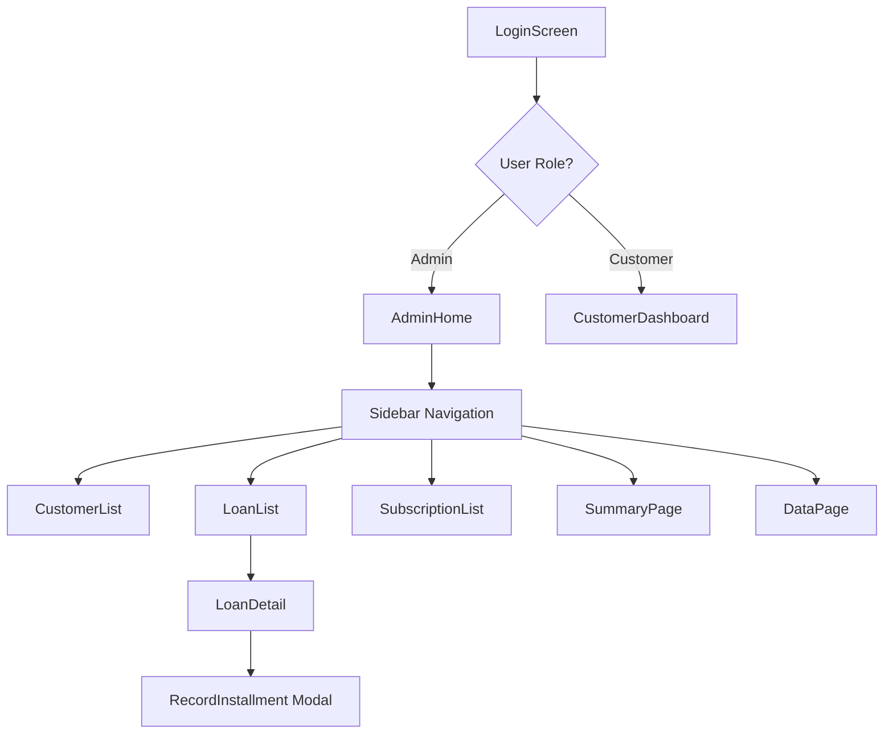

# Android Migration Plan: Loan-App

**Source**: React + TypeScript + Vite + Supabase Web App  
**Target**: Native Android (Kotlin + Jetpack Compose)  
**Existing Mobile**: Expo WebView wrapper (can be referenced but replacing)

---

## Executive Summary

This document provides a step-by-step migration plan to build a native Android app from the existing React web application. The web app is a loan management system with:

- **8 core database tables** in Supabase (PostgreSQL)
- **16 screens/pages** and **11 modals**
- **2 user roles**: Admin (full access) and Scoped Customer (limited view)
- **Supabase Auth** for authentication with JWT tokens

> [!IMPORTANT]
> The existing Expo WebView wrapper in `/loan-app-mobile` provides reference for native bridge patterns but should be replaced with a fully native implementation.

---

## Priority Classification

| Priority | Features |
|----------|----------|
| **must-have** | Login, CustomerDashboard, LoanList, LoanDetail, SubscriptionList, Installment recording |
| **important** | CustomerList, Summary, DataPage, LoanSeniority, AddRecord, ChangePassword |
| **nice-to-have** | TrashPage, FY Breakdown charts, Analytics |
| **blocking** | Authentication flow (prevents all other features) |

---

## Section 1 — Repo Overview & Indexing ✅

**Status**: Completed  
**Output**: [repo_index.json](file:///C:/Users/sreed/.gemini/antigravity/brain/70927568-f49b-4557-b8b3-6cd4a33a78eb/repo_index.json)

### Developer Prompt

```
- ACTION: Index repository and generate file inventory
- INPUT: d:\Sherry\Projects\Github\Loan-App
- COMMAND: Scan all files from repo root. Return repo_index.json with file paths, types, sizes.
- EXPECTED_OUTPUT_FILES: repo_index.json
- SUCCESS_CRITERIA: JSON file contains all 78+ source files with tech stack identified
```

---

## Section 2 — Extract SQL & DB Usage ✅

**Status**: Completed  
**Output**: [sql_extraction.json](file:///C:/Users/sreed/.gemini/antigravity/brain/70927568-f49b-4557-b8b3-6cd4a33a78eb/sql_extraction.json)

### Database Schema Summary

| Table | Purpose | Android Entity |
|-------|---------|----------------|
| `customers` | User profiles | `CustomerEntity` |
| `loans` | Loan records | `LoanEntity` |
| `installments` | Loan payments | `InstallmentEntity` |
| `subscriptions` | Subscription payments | `SubscriptionEntity` |
| `data_entries` | Credit/Debit/Expense | `DataEntryEntity` |
| `loan_seniority` | Queue for loan priority | `SeniorityEntity` |
| `customer_interest` | Quarterly interest tracking | `InterestEntity` |
| `documents` | PDF file references | `DocumentEntity` |

### Developer Prompt

```
- ACTION: Extract all SQL queries and ORM patterns
- INPUT: src/context/DataContext.tsx, scripts/*.sql, src/types.ts
- COMMAND: Scan for Supabase operations, map to tables, extract query patterns
- EXPECTED_OUTPUT_FILES: sql_extraction.json
- SUCCESS_CRITERIA: All 10 tables mapped with CRUD operations documented
```

---

## Section 3 — API Endpoints & Contracts ✅

**Status**: Completed  
**Output**: [api_contracts.json](file:///C:/Users/sreed/.gemini/antigravity/brain/70927568-f49b-4557-b8b3-6cd4a33a78eb/api_contracts.json)

### Key Endpoints

| Endpoint | Method | Auth | Purpose |
|----------|--------|------|---------|
| `/auth/v1/token?grant_type=password` | POST | None | Sign in |
| `/rest/v1/customers` | GET/POST | JWT | Customer CRUD |
| `/rest/v1/loans` | GET/POST | JWT | Loan CRUD |
| `/rest/v1/installments` | GET/POST | JWT | Payment recording |
| `/storage/v1/object/*` | GET | Signed URL | PDF downloads |

### Developer Prompt

```
- ACTION: Document API contracts with schemas
- INPUT: src/context/DataContext.tsx, src/lib/supabase.ts
- COMMAND: Extract HTTP endpoints, auth requirements, request/response schemas
- EXPECTED_OUTPUT_FILES: api_contracts.json
- SUCCESS_CRITERIA: All endpoints documented with curl examples
```

---

## Section 4 — App Layout & Navigation ✅

**Status**: Completed  
**Output**: [ui_components.json](file:///C:/Users/sreed/.gemini/antigravity/brain/70927568-f49b-4557-b8b3-6cd4a33a78eb/ui_components.json)

### Navigation Architecture



### Android Navigation Mapping

| Web Route | Android Destination | Type |
|-----------|---------------------|------|
| `/login` | `LoginScreen` | Activity |
| `/` | `DashboardScreen` | Fragment/Composable |
| `/loans` | `LoanListScreen` | Fragment/Composable |
| `/loans/:id` | `LoanDetailScreen` | Fragment/Composable |

### Developer Prompt

```
- ACTION: Map UI components to Android equivalents
- INPUT: src/components/pages/*, src/App.tsx
- COMMAND: Extract screens, modals, navigation flows, map to Compose/XML
- EXPECTED_OUTPUT_FILES: ui_components.json, screens_map.md
- SUCCESS_CRITERIA: All 16 screens and 11 modals mapped with Android patterns
```

---

## Section 5 — Mobile-Specific UI Needs

### Components Requiring Adaptation

| Web Component | Issue | Android Solution |
|---------------|-------|------------------|
| `LoanTableView` (84KB) | Wide table columns | `LazyColumn` with `LoanCard` expandable items |
| `CustomerDetailModal` (88KB) | Large modal | Full-screen `Screen` with back navigation |
| Hover states | No hover on touch | Swipe actions (`SwipeToDismiss`) or long-press menus |
| `Chart.js` charts | Not native | `MPAndroidChart` or Compose Canvas |
| `Framer Motion` | Web animations | `AnimatedVisibility`, `animate*AsState` |

### Developer Prompt

```
- ACTION: Create mobile UI adaptation checklist
- INPUT: ui_components.json, src/components/pages/*.tsx
- COMMAND: Identify hover-only, table, and modal patterns. Propose native alternatives.
- EXPECTED_OUTPUT_FILES: mobile_ui_checklist.md
- SUCCESS_CRITERIA: All table components have card-based alternatives proposed
```

---

## Section 6 — Assets, Fonts & Media

### Current Assets

| Asset Type | Location | Count | Notes |
|------------|----------|-------|-------|
| Icons | `src/constants.tsx` (inline SVG) | ~20 | Convert to Vector Drawables |
| Splash | `public/`, `loan-app-mobile/assets/` | 3 | Already have adaptive icon |
| Fonts | TailwindCSS defaults | 0 custom | Use Material3 typography |
| Documents | Supabase Storage | Dynamic | PDF download via API |

### Android Density Requirements

```
mdpi: 1x (baseline)
hdpi: 1.5x  
xhdpi: 2x
xxhdpi: 3x
xxxhdpi: 4x
```

### Developer Prompt

```
- ACTION: Inventory and convert assets
- INPUT: src/constants.tsx (SVG icons), public/, loan-app-mobile/assets/
- COMMAND: List all assets, extract SVGs, create conversion commands
- EXPECTED_OUTPUT_FILES: assets_report.md, res/drawable-*/*.xml
- SUCCESS_CRITERIA: All icons converted to vector drawables, splash assets sized
```

---

## Section 7 — Authentication & Security

### Current Auth Flow

1. User enters email/phone + password on `LoginPage`
2. Phone numbers auto-convert to `{phone}@loanapp.local`
3. Supabase Auth issues JWT + refresh token
4. Session stored in localStorage (web) / SecureStore (mobile)
5. 30-minute inactivity timeout with modal warning

### Android Implementation

| Concern | Web Solution | Android Solution |
|---------|--------------|------------------|
| Token storage | `localStorage` | `EncryptedSharedPreferences` |
| Session refresh | Supabase JS auto-refresh | `supabase-kt` with `SessionManager` |
| Biometric | N/A | `BiometricPrompt` API |
| Inactivity logout | `InactivityLogoutModal` | `WorkManager` + lifecycle observers |

### Sensitive Endpoints

- `/auth/v1/token` — Credentials
- `/rest/v1/customers` — PII
- All endpoints require JWT

### Developer Prompt

```
- ACTION: Document auth flows and security requirements
- INPUT: src/context/DataContext.tsx (signIn, signOut), src/components/pages/LoginPage.tsx
- COMMAND: Extract auth flow, token handling, session management
- EXPECTED_OUTPUT_FILES: auth_flow.md
- SUCCESS_CRITERIA: Login flow documented, Android secure storage mapped
```

---

## Section 8 — State Management & Business Logic

### Current Architecture

```
React Context (DataContext.tsx) ~103KB
├── Session state
├── Entity arrays (customers, loans, subscriptions, etc.)
├── Lookup maps (customerMap, installmentsByLoanId)
├── CRUD operations (50+ functions)
└── Caching layer (localStorage, disabled on mobile)
```

### Android Architecture Mapping

| Web Pattern | Android Pattern |
|-------------|-----------------|
| `DataContext` | `ViewModel` + `Repository` |
| `useState` | `MutableStateFlow` / `LiveData` |
| `useCallback` | Coroutine functions |
| `useMemo` (lookup maps) | `StateFlow.map {}` |
| Parallel fetches | `async/await` with `coroutineScope` |

### Developer Prompt

```
- ACTION: Map state management to Android architecture
- INPUT: src/context/DataContext.tsx
- COMMAND: Extract state shapes, CRUD functions, map to ViewModel+Repository
- EXPECTED_OUTPUT_FILES: architecture_mapping.md
- SUCCESS_CRITERIA: All 50+ context functions mapped to Kotlin equivalents
```

---

## Section 9 — Offline, Caching & Sync

### Current Behavior

- **Caching**: 5-minute localStorage cache (disabled on mobile WebView)
- **Offline**: No offline support
- **Sync**: Always fresh fetch from Supabase

### Android Recommendation

| Strategy | Implementation |
|----------|----------------|
| Local DB | Room with same schema as Supabase |
| Sync | Online-first with offline fallback |
| Conflict | Server wins (last-write-wins) |
| Background sync | `WorkManager` with exponential backoff |

### Developer Prompt

```
- ACTION: Design offline sync strategy
- INPUT: sql_extraction.json, src/context/DataContext.tsx
- COMMAND: Propose Room entities, sync worker, conflict resolution
- EXPECTED_OUTPUT_FILES: sync_strategy.md
- SUCCESS_CRITERIA: Room schema defined, WorkManager sync pseudo-code included
```

---

## Section 10 — Performance Hotspots

### Identified Issues

| Issue | Location | Impact | Solution |
|-------|----------|--------|----------|
| Large components | `CustomerListPage` (119KB) | Slow render | Pagination + virtualization |
| Parallel fetches | `fetchData()` | Network burst | Debounce + caching |
| No pagination | All list queries | Memory | Room paging + Supabase range |
| Large modals | `CustomerDetailModal` (88KB) | UI jank | Lazy composition |

### Telemetry Recommendations

- Firebase Crashlytics for crash reporting
- Firebase Performance Monitoring
- Custom traces: Auth time, List load time, Form submission time

### Developer Prompt

```
- ACTION: Identify performance hotspots
- INPUT: src/components/pages/*.tsx (file sizes), src/context/DataContext.tsx
- COMMAND: Find large components, heavy queries, blocking operations
- EXPECTED_OUTPUT_FILES: performance_audit.md
- SUCCESS_CRITERIA: Top 5 hotspots identified with optimization proposals
```

---

## Section 11 — Build, CI & Dependencies

### Current Web Dependencies

| Package | Version | Android Equivalent |
|---------|---------|-------------------|
| `@supabase/supabase-js` | 2.44.4 | `io.github.jan-tennert.supabase:*` |
| `react-router-dom` | 7.7.1 | Navigation Compose |
| `framer-motion` | 12.23.11 | Compose Animations |
| `react-hook-form` | 7.61.1 | Form state in ViewModel |
| `chart.js` | 4.5.0 | `MPAndroidChart` / Compose Canvas |
| `decimal.js` | 10.6.0 | `java.math.BigDecimal` |
| `xlsx` | 0.18.5 | Apache POI (if needed) |

### Android Build Plan

```kotlin
// build.gradle.kts (app)
plugins {
    id("com.android.application")
    id("org.jetbrains.kotlin.android")
    id("com.google.devtools.ksp")
}

dependencies {
    // Supabase
    implementation("io.github.jan-tennert.supabase:gotrue-kt:2.x")
    implementation("io.github.jan-tennert.supabase:postgrest-kt:2.x")
    implementation("io.github.jan-tennert.supabase:storage-kt:2.x")
    
    // Compose
    implementation("androidx.compose.ui:ui:1.6.x")
    implementation("androidx.navigation:navigation-compose:2.7.x")
    
    // Room
    implementation("androidx.room:room-runtime:2.6.x")
    ksp("androidx.room:room-compiler:2.6.x")
    
    // Security
    implementation("androidx.security:security-crypto:1.1.0-alpha06")
}
```

### Developer Prompt

```
- ACTION: Create Android build configuration
- INPUT: package.json, loan-app-mobile/package.json
- COMMAND: Map web deps to Android, create Gradle config
- EXPECTED_OUTPUT_FILES: android/build.gradle.kts
- SUCCESS_CRITERIA: All critical dependencies mapped, compiles cleanly
```

---

## Section 12 — Testing & QA

### Current Test Coverage

- **Unit tests**: None found
- **Integration tests**: None found
- **E2E tests**: None found

### Android Test Strategy

| Test Type | Framework | Critical Paths |
|-----------|-----------|----------------|
| Unit | JUnit 5 + MockK | ViewModels, Repositories, Utils |
| Integration | AndroidX Test | Room DAOs, Supabase client |
| UI | Compose Testing | Login flow, Form submissions |
| E2E | Espresso/Maestro | Full user flows |

### Critical Test Cases (Priority Order)

1. ✅ Login with email/password
2. ✅ Login with phone (auto-convert)
3. ✅ Session persistence across app restart
4. ✅ Fetch and display loan list
5. ✅ Record installment payment
6. ◻️ Offline mode fallback
7. ◻️ Sync conflict resolution

### Developer Prompt

```
- ACTION: Create test plan for Android
- INPUT: ui_components.json user_flows, api_contracts.json
- COMMAND: Map critical paths to test cases, prioritize
- EXPECTED_OUTPUT_FILES: test_plan.md
- SUCCESS_CRITERIA: Top 10 test cases defined with frameworks specified
```

---

## Staged Developer Prompts (Run Sequentially)

### Phase 1: Foundation (Weeks 1-2)

#### Prompt 1.1: Project Setup
```
- ACTION: Initialize Android project with Jetpack Compose
- INPUT: None (greenfield)
- COMMAND: Create new Android project, add Supabase/Room/Compose dependencies
- EXPECTED_OUTPUT_FILES: android/ folder structure
- SUCCESS_CRITERIA: Project compiles, runs on emulator
```

#### Prompt 1.2: Auth Implementation
```
- ACTION: Implement login screen and Supabase auth
- INPUT: api_contracts.json (auth endpoints), LoginPage.tsx
- COMMAND: Create LoginScreen composable, SessionManager, EncryptedStorage
- EXPECTED_OUTPUT_FILES: LoginScreen.kt, SessionManager.kt
- SUCCESS_CRITERIA: Can login with email/phone, session persists
```

### Phase 2: Core Screens (Weeks 3-4)

#### Prompt 2.1: Data Layer
```
- ACTION: Implement Room database and Supabase repository
- INPUT: sql_extraction.json, src/types.ts
- COMMAND: Create Room entities, DAOs, SupabaseRepository
- EXPECTED_OUTPUT_FILES: database/*.kt, repository/*.kt
- SUCCESS_CRITERIA: All 8 entities defined, basic CRUD works
```

#### Prompt 2.2: Dashboard & Navigation
```
- ACTION: Implement dashboard and navigation
- INPUT: ui_components.json, App.tsx
- COMMAND: Create Navigation graph, DashboardScreen, Sidebar/BottomNav
- EXPECTED_OUTPUT_FILES: navigation/*.kt, screens/DashboardScreen.kt
- SUCCESS_CRITERIA: Role-based routing works, navigation functional
```

### Phase 3: Feature Screens (Weeks 5-6)

#### Prompt 3.1: Loan Management
```
- ACTION: Implement LoanListScreen and LoanDetailScreen
- INPUT: LoanTableView.tsx, LoanDetailPage.tsx
- COMMAND: Create card-based list, detail view, installment recording
- EXPECTED_OUTPUT_FILES: screens/loan/*.kt
- SUCCESS_CRITERIA: Loan list loads, can record installments
```

#### Prompt 3.2: Subscription & Data Entries
```
- ACTION: Implement SubscriptionList and DataPage
- INPUT: SubscriptionTableView.tsx, DataPage.tsx
- COMMAND: Create subscription list, data entry forms
- EXPECTED_OUTPUT_FILES: screens/subscription/*.kt, screens/data/*.kt
- SUCCESS_CRITERIA: Both screens functional with CRUD
```

### Phase 4: Polish & Testing (Weeks 7-8)

#### Prompt 4.1: Offline Support
```
- ACTION: Implement offline mode with sync
- INPUT: sync_strategy.md
- COMMAND: Add Room caching, WorkManager sync, conflict handling
- EXPECTED_OUTPUT_FILES: sync/*.kt
- SUCCESS_CRITERIA: App works offline, syncs when online
```

#### Prompt 4.2: Testing
```
- ACTION: Add critical path tests
- INPUT: test_plan.md
- COMMAND: Write unit, integration, UI tests for auth + core flows
- EXPECTED_OUTPUT_FILES: test/*.kt
- SUCCESS_CRITERIA: 80%+ coverage on critical paths
```

---

## Ambiguities & Safe Defaults

| Ambiguity | Options Found | Safe Default | Notes |
|-----------|---------------|--------------|-------|
| Database | Supabase (PostgreSQL) | Continue with Supabase | No alternative |
| Auth | Supabase Auth only | Supabase Auth | Phone→email conversion maintained |
| User roles | `isScopedCustomer` flag | Role stored in `customers.user_id` link | Admin = no matching customer record |

---

## Next Three Developer Actions

1. **Initialize Android project** with Compose + Supabase-kt + Room
2. **Implement LoginScreen** with auth flow from `api_contracts.json`
3. **Create Room entities** from `sql_extraction.json` schema

---

## Generated Artifacts

| Artifact | Path | Status |
|----------|------|--------|
| repo_index.json | [Link](file:///C:/Users/sreed/.gemini/antigravity/brain/70927568-f49b-4557-b8b3-6cd4a33a78eb/repo_index.json) | ✅ |
| sql_extraction.json | [Link](file:///C:/Users/sreed/.gemini/antigravity/brain/70927568-f49b-4557-b8b3-6cd4a33a78eb/sql_extraction.json) | ✅ |
| api_contracts.json | [Link](file:///C:/Users/sreed/.gemini/antigravity/brain/70927568-f49b-4557-b8b3-6cd4a33a78eb/api_contracts.json) | ✅ |
| ui_components.json | [Link](file:///C:/Users/sreed/.gemini/antigravity/brain/70927568-f49b-4557-b8b3-6cd4a33a78eb/ui_components.json) | ✅ |
| migration_plan.md | This file | ✅ |
